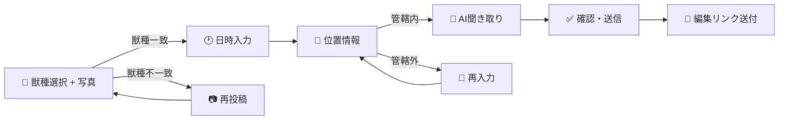
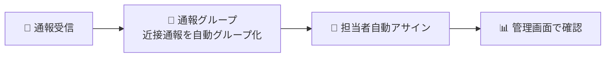
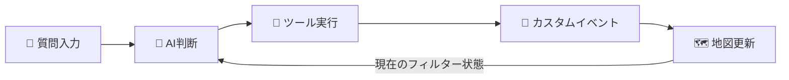

<p align="center">
  
</p>

<h1 align="center">AIRS</h1>

<p align="center">
  <strong>Animal Incident Reporting System</strong><br>
  獣害通報から管理・分析まで、AIで一気通貫に自動化する自治体向けプラットフォーム
</p>

<p align="center">
  <a href="https://nextjs.org/"></a>
  <a href="https://www.typescriptlang.org/"></a>
  <a href="https://www.prisma.io/"></a>
  <a href="https://ai.google.dev/"></a>
  <a href="https://cloud.google.com/run"></a>
  <a href="https://opensource.org/licenses/BSD-3-Clause"></a>
</p>

<p align="center">
  <a href="https://airs.demo.dx-junkyard.com/">Demo</a> &nbsp;|&nbsp;
  <a href="https://www.youtube.com/watch?v=1C675vr8atA">Video</a> &nbsp;|&nbsp;
  <a href="https://zenn.dev/fooqoo/articles/eeeebf27353744">Zenn 記事</a>
</p>

---

## Background

2023年度のクマによる人身被害は219件と過去最悪を記録し、住宅地への出没も増加しています。
[Tokyo OSS Party 2023](https://www.youtube.com/watch?v=5nZW4lGoQg0&t=1999s) で獣害通報LINEアプリを開発・総合優勝したことをきっかけに、[奥多摩町](https://www.animaldamage.tokyo/okutama/)・[青梅市](https://www.animaldamage.tokyo/ome/)・[東京都環境局（大島キョン通報）](https://www.animaldamage.tokyo/oshima/)への導入が実現しました。

導入先の自治体へのヒアリングから、電話通報だけでは解決できない **3つの壁** が浮かび上がりました。

| 壁 | 課題 |
|:--:|------|
| **1** | **電話通報の限界** -- 24時間対応が困難。聞き取りの質が担当者の経験に依存 |
| **2** | **通報管理の煩雑さ** -- 紙ベースの管理、誤報の修正・削除作業 |
| **3** | **分析の困難** -- Excelで手動集計。傾向の把握に時間がかかる |

AIRS はこの悪循環を断ち切るために開発されました。

## Design Philosophy

> **AIが判断を代替するのではなく、「判断の土台を整える」ことに徹する。**

| AIが主導する領域 | 人間が主導する領域 |
|-----------------|------------------|
| LINE対話形式の通報受付 | 対応方針の最終判断 |
| 画像解析・誤報フィルタリング | 現場対応（罠設置・パトロール） |
| データ分析・傾向把握 | 住民コミュニケーション |

## Features

### 1. AIチャット通報（LINE）

住民がLINEから通報すると、AIが対話形式で状況を聞き取り、画像解析まで自動処理します。



- **Agentic Vision** (Gemini 3 Flash) が写真をズーム・クロップして獣種を判定
- ジオフェンシングで管轄外の通報を自動フィルタリング
- 送信後にLINEへ編集リンクを送付（JWT認証でログイン不要）

### 2. 通報管理

通報受信から「判断の土台」が整うまでの自動処理:



- **Spatial Intelligence**: PostGISで半径500m以内 × 過去60分の通報を自動グループ化
- 担当者の地図上の担当地域ポイントから最近傍の職員を自動アサイン
- 通報の編集・削除、位置情報の修正、獣種の変更に対応
- 統計ダッシュボードで獣種別割合・通報推移・時間帯別傾向をリアルタイム表示

### 3. AIマップ

GIS空間分析とAIエージェントの統合:

| レイヤー | 用途 |
|---------|------|
| **Cluster** | 通報マーカーの個別確認、密集エリアの自動クラスタリング |
| **Heatmap** | 通報密度をグラデーションで俯瞰 |
| **Timeline** | 時間軸スライダーで出没パターンをアニメーション再生 |

**AI分析エージェント**: チャットで質問するだけで、AIが地図のフィルター操作・SQLクエリ実行・周辺施設マッピングを自動実行します。



| Tool | 機能 |
|------|------|
| `searchReports` | 通報の検索・フィルタリング。地図フィルターを更新し、場所指定時は地図も移動 |
| `runSql` | 集計・統計クエリ (GROUP BY, COUNT等)。結果をテーブル表示 |
| `searchLandmarks` | Overpass API経由で周辺施設を検索し、地図上にマーカー表示 |

### 4. Supporting Features

| 機能 | 概要 |
|------|------|
| システム設定 | ジオフェンシング、自動グループ化条件、対象獣種の追加・削除 |
| 職員管理 | 職員登録と担当地域ポイントの地図設定 |
| 施設管理 | 周辺の学校・公園を検索・登録。AI地図操作にも連携 |
| CSV一括インポート | 過去データの非同期一括取り込み |
| ヘルプチャットボット | 管理者・一般利用者向けの生成AIチャットボット |

## Architecture

<p align="center">
  
</p>

同一のNext.jsコードベースから、環境変数 `ADMIN_MODE` の切り替えで2つのCloud Runサービスをデプロイしています。

## Tech Stack

| Category | Technology |
|----------|-----------|
| **Framework** | Next.js 16 (App Router, Server Actions, React 19) |
| **Language** | TypeScript 5 |
| **AI** | Vercel AI SDK + Google Gemini (Agentic Vision) |
| **Database** | PostgreSQL + PostGIS, Prisma ORM |
| **State** | TanStack Query v5 (server), Jotai (client), nuqs (URL) |
| **UI** | Tailwind CSS 4, Digital Agency Design System, HeroUI |
| **GIS** | Leaflet + React Leaflet (Cluster / Heatmap / Timeline) |
| **Messaging** | LINE Messaging API |
| **Infra** | GCP (Cloud Run, Cloud SQL, Cloud Storage, Secret Manager) |
| **IaC** | OpenTofu |
| **Dev Tools** | Storybook 10, ESLint 9, Prettier, Husky |

## Getting Started

### Prerequisites

- Node.js 24.11.0
- pnpm 10+

### Setup

```bash
# Clone
git clone https://github.com/fooqoo/airs.git
cd airs

# Install dependencies
pnpm install

# Configure environment
cp .env.example .env
# Edit .env with your DATABASE_URL, GOOGLE_GENERATIVE_AI_API_KEY, etc.

# Generate Prisma client
pnpm run db:generate

# Start dev server
pnpm run dev
```

<http://localhost:3000> でアプリケーションにアクセスできます。

### Node.js Version Manager

<details>
<summary>macOS (nodenv)</summary>

```bash
brew install nodenv node-build
echo 'eval "$(nodenv init -)"' >> ~/.zshrc
source ~/.zshrc
nodenv install
nodenv rehash
```

</details>

<details>
<summary>Windows (fnm)</summary>

```powershell
winget install Schniz.fnm
# Add to PowerShell profile:
fnm env --use-on-cd | Out-String | Invoke-Expression
fnm install
fnm use
```

</details>

### pnpm Install

```bash
corepack enable
```

Or via package manager: `brew install pnpm` (macOS) / `winget install pnpm` (Windows)

### Commands

| Command | Description |
|---------|-------------|
| `pnpm run dev` | Development server (localhost:3000) |
| `pnpm run build` | Production build |
| `pnpm run lint` | ESLint |
| `pnpm run storybook` | Storybook (localhost:6006) |
| `pnpm run db:generate` | Prisma client generation |
| `pnpm run db:push` | Push schema to database |
| `pnpm run db:studio` | Prisma Studio |

## Project Structure

```
src/
├── app/                    # Next.js App Router
│   ├── admin/              #   管理画面 (report, staff, facility, settings)
│   ├── ai-report/          #   AI聞き取りシミュレーター
│   ├── help/               #   ヘルプページ
│   ├── line/               #   LINE連携ページ
│   ├── map/                #   地図ページ
│   ├── report/             #   通報ページ
│   └── api/                #   Route Handlers (LINE webhook, analysis, health)
│
├── features/               # 機能モジュール
│   ├── admin/              #   管理画面ロジック
│   ├── admin-chatbot/      #   管理者向けチャットボット
│   ├── ai-report/          #   AI聞き取り（ステップ式入力）
│   ├── analysis/           #   AIデータ分析
│   ├── common/             #   共通ユーティリティ
│   ├── dashboard/          #   統計ダッシュボード
│   ├── event/              #   通報グループ管理
│   ├── facility/           #   施設検索・登録
│   ├── help-chatbot/       #   ヘルプチャットボット
│   ├── line-bot/           #   LINE連携
│   ├── map/                #   GIS地図（レイヤー/拡張）
│   ├── report/             #   通報CRUD・一括操作
│   ├── staff/              #   職員管理
│   └── system-setting/     #   システム設定
│
├── atoms/                  # グローバル Jotai atoms
├── config/                 # 設定ファイル
├── constants/              # 定数定義
├── styles/                 # グローバルスタイル
├── types/                  # 型定義
│
├── components/             # 共有UIコンポーネント
│   ├── ui/                 #   デザインシステムコンポーネント
│   └── layout/             #   AppLayout, Sidebar
│
├── hooks/                  # カスタム React フック
│   ├── mutations/          #   TanStack Query mutations
│   ├── queries/            #   TanStack Query queries
│   └── forms/              #   Jotai フォームフック
│
└── server/                 # バックエンド（DDD）
    ├── domain/             #   エンティティ, 値オブジェクト, リポジトリI/F
    ├── application/        #   ユースケース, DTO
    └── infrastructure/     #   Prismaリポジトリ, AI統合, LINE, Geo

prisma/                     # データベーススキーマ
infra/                      # GCP / OpenTofu 定義
```

## Database

PostgreSQL + PostGIS で空間データを管理しています。

主要テーブル: `reports` / `events` / `event_reports` / `staffs` / `staff_locations` / `facilities` / `line_sessions` / `system_settings`

`Report`, `Event`, `StaffLocation`, `Facility` は PostGIS の `geometry(Point, 4326)` カラムを持ち、`ST_DWithin` / `ST_Distance` による空間検索に対応しています。

## Demo

一般向けのデモ環境を公開しています。[京都府クマ目撃情報](https://data.bodik.jp/dataset/260002_bear) (CC BY 4.0) のオープンデータを使用。

**Web**: <https://airs.demo.dx-junkyard.com/>

**LINE**: 以下のQRコードから友だち追加して通報を体験できます。

<p align="center">
  <a href="https://lin.ee/BEl9F8R"></a>
</p>

管理画面のデモを利用されたい方は、[fooqoofooqoo56@gmail.com](mailto:fooqoofooqoo56@gmail.com) までご連絡ください。

## Contributors

**dx-junkyard** モンキーハンターチーム — Tokyo OSS Party 2023 総合優勝 → 奥多摩町・青梅市・東京都環境局への導入

<table>
  <tr>
    <th></th>
    <th>Name</th>
    <th>Contributions</th>
  </tr>
  <tr>
    <td align="center"><a href="https://github.com/FooQoo"></a></td>
    <td><a href="https://github.com/FooQoo"><b>FooQoo</b></a></td>
    <td>プロジェクトリード、通報管理、インフラ</td>
  </tr>
  <tr>
    <td align="center"><a href="https://github.com/mutsu-6"></a></td>
    <td><a href="https://github.com/mutsu-6"><b>mutsu-6</b></a></td>
    <td>LINE聞き取りAI</td>
  </tr>
  <tr>
    <td align="center"><a href="https://github.com/yamamoto-ryuzo"></a></td>
    <td><a href="https://github.com/yamamoto-ryuzo"><b>yamamoto-ryuzo</b></a></td>
    <td>AIマップ</td>
  </tr>
  <tr>
    <td align="center"><a href="https://github.com/Puchio"></a></td>
    <td><a href="https://github.com/Puchio"><b>Puchio</b></a></td>
    <td>ロゴ作成、動画作成</td>
  </tr>
  <tr>
    <td align="center"><a href="https://github.com/urashin"></a></td>
    <td><a href="https://github.com/urashin"><b>urashin</b></a></td>
    <td>ビジョン・戦略</td>
  </tr>
</table>

## Note

本リポジトリの `main` ブランチは、セキュリティ上の理由により、全履歴を squash した単一コミットで再構成しています。

## License

[BSD 3-Clause](LICENSE)

本ソフトウェアを利用・再配布する際は、dx-junkyard の著作権表示を保持してください。詳細は [LICENSE](LICENSE) をご確認ください。
